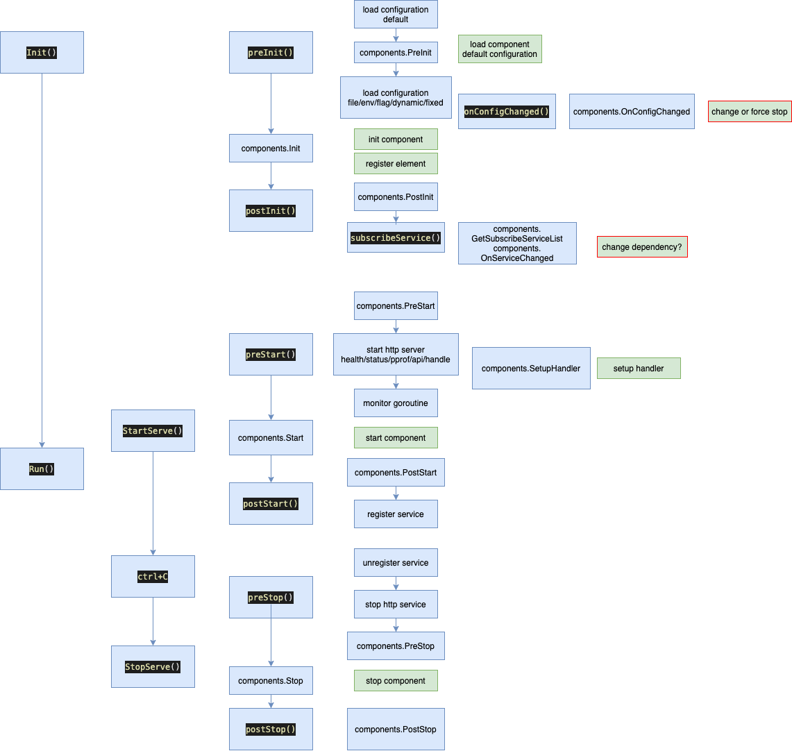

## Microservice & Component

Micro centralizes most common functionalities, different components implement different specific functionalities, and register specific implementation elements to the dictionary of Micro, which manages their lifecycle and makes them available for other elements.

The sequence diagram of the call is as follows:

The picture unfolds details from left to right. The blue box represents the actions of Micro, and the green box represents the actions of the component.

## Initialization

During the initialization process, it mainly completes configuration settings, initialization and registration of elements, binding of service change events, etc. 
The configuration reading is divided from low to high levels as follows:

- Default configuration
- Configuration file
- Environment variables
- Command line flag
- Dynamic configuration
- Fixed configuration

The final value of a configuration item is determined by the first value encountered from high to low levels.

The dynamic configuration is configured according to the project's TopologyConfig, saved in Nacos, and Micro will automatically subscribe to the changes in the configuration, extract the corresponding NodeConfig information, and provide it for the component to consume.

Existing common components include logging, tracing, etc.

## Startup

During the startup process, Micro will initialize the HTTP service, which is used for the REST service of the component, exposing metric and pprof interfaces, etc.

Micro will also register the service to Nacos.

## Stop

During the stop process, Micro will deregister the service from Nacos and end all components.
