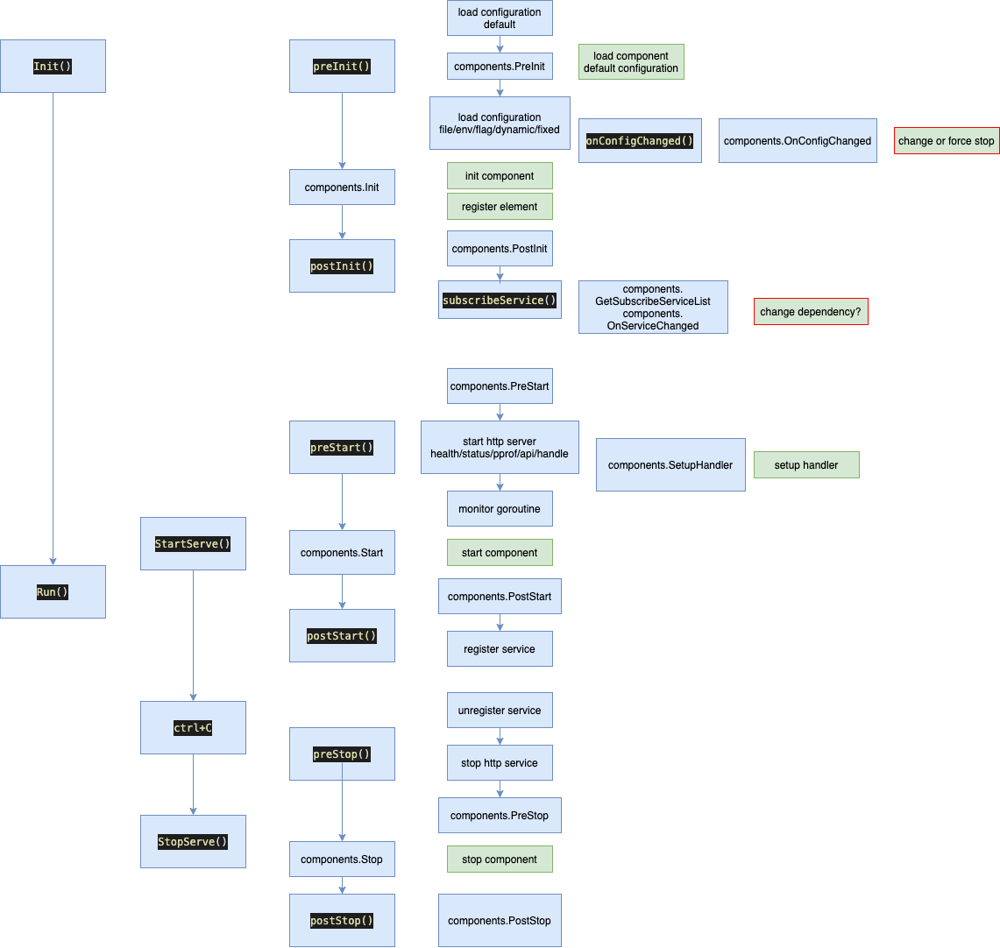

# 微服务与组件

micro集中多数通用功能，不同的component实现不同的具体功能，并注册具体实现element到micro的字典中，由micro统一管理生命周期，供其他element使用。

调用顺序图如下：

图片由左至右，逐步展开细节。蓝色框为micro的动作，绿色框为component的动作。

## 初始化

在初始化过程中，主要完成配置设置、初始化和注册element、绑定服务变动事件等操作。其中配置读取按层次由低到高分为

- 默认配置
- 配置文件
- 环境变量
- 命令行flag
- 动态配置
- 固定配置

某一配置项的最终取值按层次有高到低最先遇到的值为准。

动态配置按项目配置TopologyConfig，保存在nacos中，micro会自动订阅配置的变化，抽取对应的NodeConfig信息，供component消费。

已有的常用component包括logging、tracing等。

## 启动

启动过程中，micro会初始化http服务，用于component的rest服务、暴露metric和pprof等接口等。

micro同时会注册服务到nacos。

## 停止

停止过程中，micro会从nacos上注销服务，并结束所有的component。
